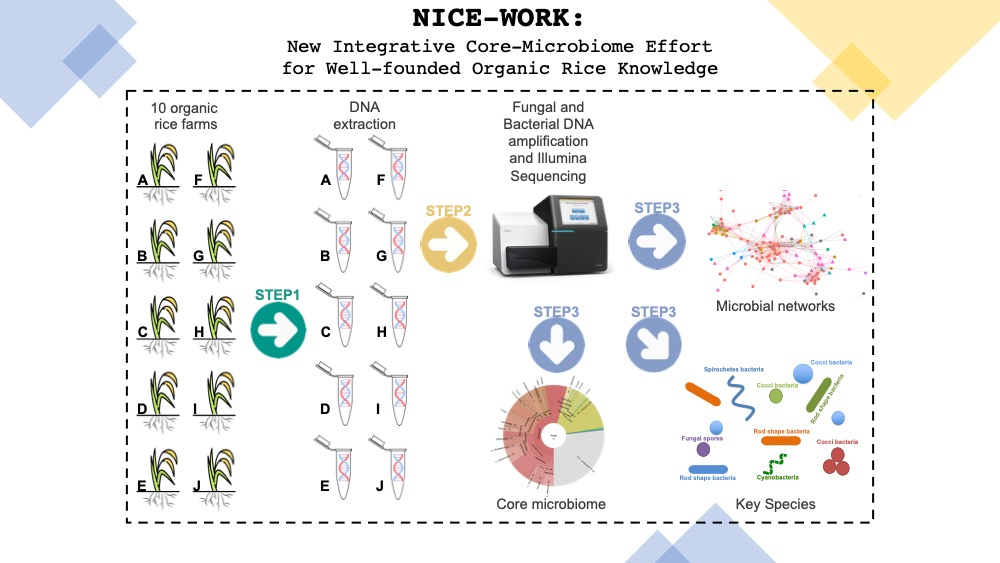

# NICE-WORK: New Integrative Core-Microbiome Effort for Well-founded Organic Rice Knowledge

 NICE-WORK: Phase 1 Plan 

## 1.Research hypothesis

### Phase 1

1. Rice (Oryza sativa) rhizosphere soil contain variety of fungal and bacterial species which are structured by geographical locations. 
2.	Although rice rhizosphere soil microbiome can be differentiated by locations, core microbiome, microbial network hubs, and key species are similar regardless of geographical locations. 

### Phase 2
1.	Applying organic fertilizer to promote rhizosphere soil core microbiome (fungi and bacteria) growth will significantly improve rice growth and productivity. 

## 2.Rationale

Rice consumption have shifted toward the organic rice farming. Thailand, which is one of the major rice producers in the world, is also adopting organic farming practice. However, research on how soil microbiome contribute to rice production in Thailand has just begun and still needed to be explored. Our group is planning to explore rice rhizosphere soil microbiome and develop a protocol to promote core microbiome growth for the next generation organic rice farming in Thailand. 

## 3.Protocols vallidation and Research Team

Next generation amplicon sequencing has been used widely and is now affordable in Thailand. However, soil microbiome are complexed especially when we investigate both fungi and bacteria. Therefore, developing this protocol require both experts in rice and microbiome research. Although, the initiative for this project has just been launched, Dr.P’Poy works on organic rice farming, Dr.P’George works on botany and plant sciences research, and Mr.Pombubpa works on microbiology and plant pathology research. Pombubpa et al., 2020 has shown that soil microbiome are strongly structured by geographical locations and have validated the protocols that can be adapted for hypothesis 1 and 2. 

## 4.Research plan

### Phase1
1.	We will select 10 locations of organic rice farms which have been approved by the Rice Department, Thailand.
2.	Five rice rhizosphere soil samples will be collected from each location. Microbial DNA will be extracted and performed next generation amplicon sequencing targeting bacteria and fungal communities.
3.	Microbial ecology approaches will be used to explore bacterial and fungal data to define geographical pattern, core microbiome, microbial network hubs, and key species.

### Phase2
1.	We will apply different organic fertilizer or organic farming practice to promote core microbiome growth and investigate how rhizosphere core microbiome changes affect rice growth and rice production. 
