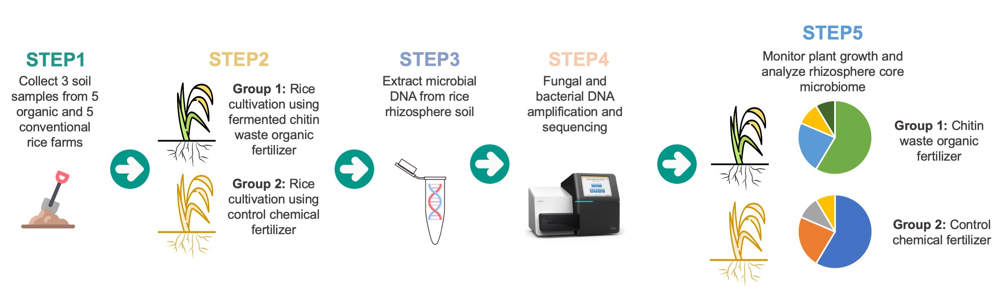

# NICE-WORK: New Integrative Core-Microbiome Effort for Well-founded Organic Rice Knowledge

## 1.Research hypothesis

1. Rice soil microbiome can differentiate cultivation methods (organic vs. chemical farming) and can be used for rapid organic farming validation.  
2. While locations influence rhizosphere soil microbes, core microbiome, microbial network hubs, and key species are similar regardless of locations or cultivation methods. 
3. Applying organic fertilizer (fermented chitin waste) to promote healthy rhizosphere soil core microbiome (fungi and bacteria) will significantly improve rice growth and productivity. 
 
 

## 2.Rationale

Thailand is one of the major rice producers in the world and we are adopting organic rice farming to reduce chemical inputs and promote healthy soil. However, organic farming validation process takes time, therefore, our plan is 1) to explore the rhizosphere soil microbiome, 2) to develop a protocol for a new rapid organic farming validation using next generation amplicon sequencing, and 3) to promote core microbiome growth using fermented chitin waste for next generation organic rice farming. 

## 3.Protocols validation

Previous work from the group has shown that fermented chitin waste outperforms chemicals and some organic fertilizers in promoting growth and yield in rice. This project aims to 1) test whether fermented chitin waste application does so by enhancing the core microbiomes/microbial networks and 2) develop a rapid organic rice farming validation using soil microbiome with adapted protocols from our recent publication. This work requires both experts in rice and microbiome research, therefore, it will be executed by joint effort of a microbiologist with expertise in microbiome research, plant scientists, and the Rice Department of Thailand. 

## 4.Research plan

### Phase1

1. Three soil samples will be collected from each location including 5 locations of organic rice farms and 5 conventional rice farms.
2. Microbial DNA will be extracted from each soil sample and performed next generation amplicon sequencing targeting bacterial and fungal communitites.
3. Microbial ecology approaches will be used to explore microbiome data and develop a rapid organic rice farming validation protocol. Geographical patterns, core microbiome, microbial network hubs, and key species will be used in validation processes. We will also build organic rice farming microbiome database which can be used for future validation protocol.

### Phase2

1. Three soil samples will be collected from each location described in Phase1.
2. Soil samples will be transported and used to cultivate the same rice variety with fermented chitin waste organic fertilizer in the greenhouse. 
3. Microbial DNA will be extracted from each rice rhizosphere soil sample. 
4. Next generation amplicon sequencing targeting bacterial and fungal communitites will be performed.
5. We will monitor core microbiome and investigate how rhizosphere core microbiome changes affect rice growth and rice production. 
 

## 5.Research Team Members
1.  Mr. Nuttapon Pombubpa
2.  Dr. Thanin Chantarachot
3. Still need P'Poy name
